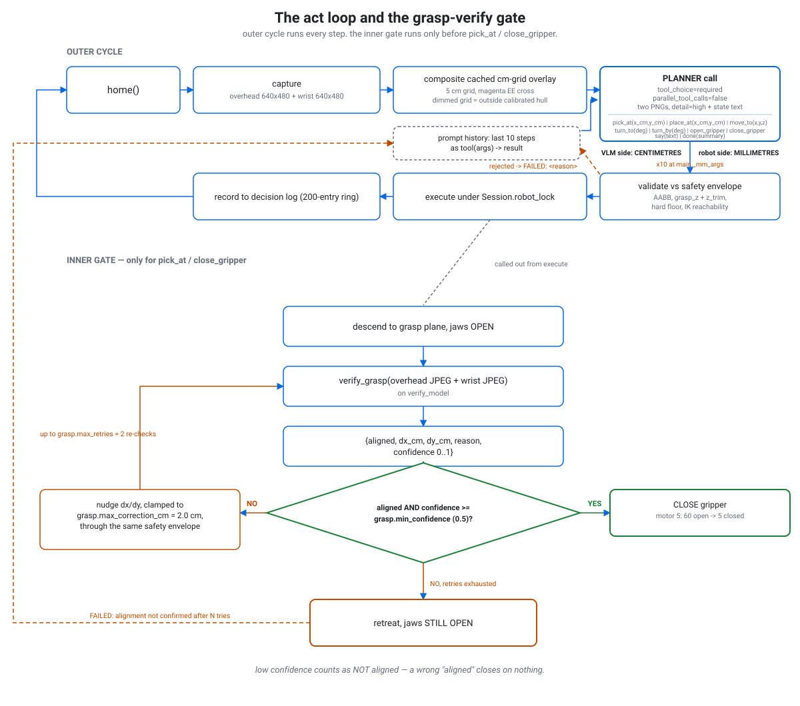
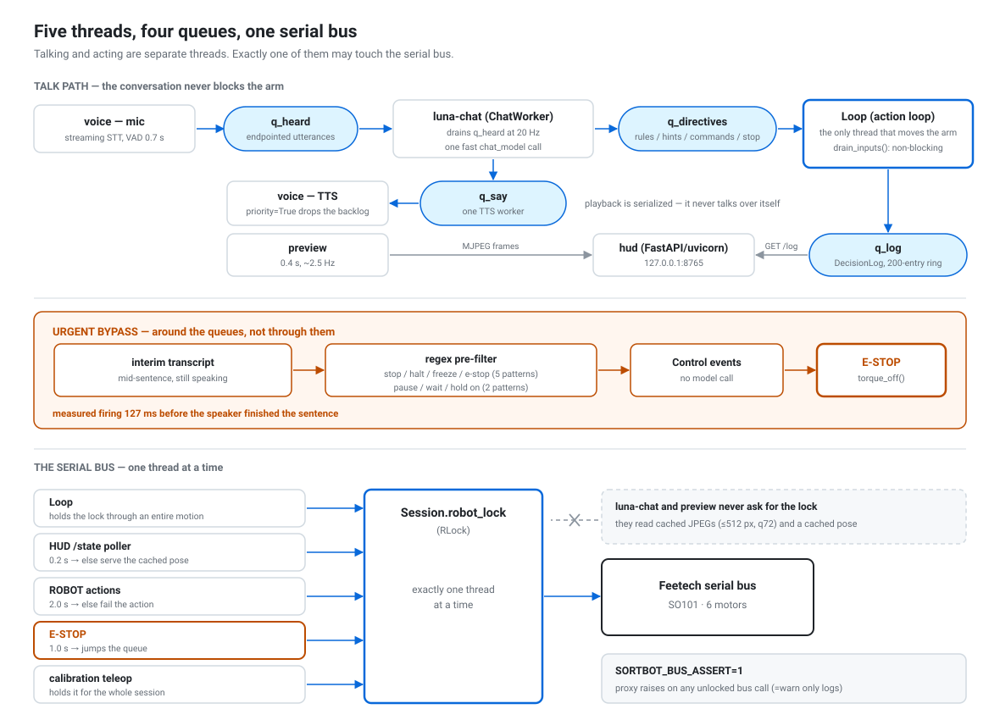
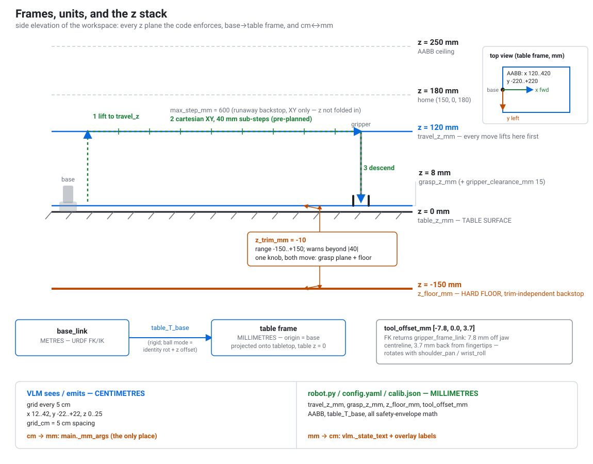

<h1 align="center">sortbot</h1>

<p align="center">
  <b>Voice-directed VLM pick-and-place on an SO101 arm.</b><br>
  It tidies a table while you talk to it.
</p>

<p align="center">
  
</p>

<p align="center">
  
  
  
  
  
  
</p>

---

## What it is

sortbot drives a 5-DOF SO101 follower arm that picks objects off a table and groups them. It has two
sensors: an overhead camera and a wrist camera. Nothing else.

There is no object detector and no predefined zones. A cm-labelled grid is composited onto the overhead
frame, and the model reads coordinates straight off that grid. Each step the planner emits exactly one tool
call — `pick_at`, `place_at`, `move_to`, `turn_to`, `turn_by`, `open_gripper`, `close_gripper`, `say`, or
`done`.

You give it a task by voice or by text, and the task is optional: with nothing specified it groups similar
items together. You can keep talking while it moves. Saying "stop" does not queue behind anything.

Before any close, `verify_grasp` reads both camera views to confirm the jaws are actually over the object.
Low confidence counts as *not* aligned, and the pick aborts with the jaws still open rather than closing
blind.

## Architecture

<picture>
  <source media="(prefers-color-scheme: dark)" srcset="assets/loop-and-grasp-gate-dark.svg">
  
</picture>

Every step of the run is the same seven-stage loop: `home()`, capture both cameras, composite the cm-grid
overlay onto the overhead frame, call the planner, validate its target against the safety envelope, execute
under `Session.robot_lock`, record to the decision log, repeat. No object detector sits anywhere in it — the
grid overlay is the only coordinate reference, and the planner reads it directly off the image.

The planner runs on the OpenAI Responses API and gets exactly one `function_call` per step
(`tool_choice=required`, `parallel_tool_calls=false`). Every tool is declared `strict=True` with
`additionalProperties=false`, so the model cannot hand back a malformed call.

The prompt payload is two images plus a text block: the overhead PNG and the wrist PNG, both at
`detail=high`, then a state block covering the overlay key, the end-effector pose in cm, whether the gripper
is open or holding, the reachable area, the current RULES, and the last 10 steps of history as
`tool(args) -> result`.

**Failure is text, not a crash.** When validation rejects a target — outside the AABB, past the hard floor,
unreachable — the rejection comes back to the planner as a `FAILED: <reason>` tool result, folded into the
same history block the next prompt sees. A grasp that aborts after exhausting its retries reports the same
way. The loop does not stop and does not except out; the model re-plans from the failure like it would from
any other observation.

**Before any close, a second, cheaper model call gates it.** `verify_grasp` looks at both frames and returns
a structured `{aligned, dx_cm, dy_cm, reason, confidence}`, capped at `max_output_tokens=400`. A
low-confidence `aligned` does not count as aligned. On a no, the arm nudges by `dx_cm`/`dy_cm` (clamped to
`max_correction_cm`) and re-checks, up to `max_retries` times; still not aligned and it retreats with the
gripper open, abort reason back into history. Every verdict lands in the decision log with a side-by-side
overhead/wrist thumbnail, so a bad grasp is auditable after the fact.

> [`sortbot/config.yaml`](sortbot/config.yaml) currently ships `grasp: verify: false` (commented
> `DISABLED at user request`), so a default install runs without this gate even though the test suite pins
> verification on. Turn it on for unattended runs.

## Talking while it moves

<picture>
  <source media="(prefers-color-scheme: dark)" srcset="assets/threads-queues-bus-dark.svg">
  
</picture>

One planner call per step is far too slow to hold a conversation, so motion, chat and the camera preview run
on separate threads that talk through small queues.

Five threads: `voice` (mic/TTS), `luna-chat` (the ChatWorker, drains `q_heard` at 20 Hz), `Loop` (the only
thread that moves the arm), `preview` (0.4 s, ~2.5 Hz) and `hud` (FastAPI/uvicorn on `127.0.0.1:8765`).
Four queues connect them: `q_heard` (endpointed utterances), `q_directives` (rules, hints, commands, stop),
`q_say` (one TTS worker; `priority=True` drops the whole backlog) and `q_log` (a 200-entry ring).
`Loop.drain_inputs()` reads `q_directives` without blocking — an empty queue just means keep moving.

**Stop runs around the queues, not through them.** An interim transcript, still mid-sentence, hits a regex
pre-filter (5 stop patterns, 2 pause patterns) and fires `torque_off()` straight through `Control` events.
No model call, no waiting for VAD to endpoint. Measured firing **127 ms before the speaker finished the
sentence**.

**Exactly one thread may touch the Feetech serial bus.** `Session.robot_lock` enforces it with a different
acquire timeout per caller: the HUD's `/state` poller waits 0.2 s and serves a cached pose on timeout,
ordinary robot actions wait 2.0 s and fail past that, E-STOP waits 1.0 s and jumps the queue, `Loop` holds
the lock through an entire motion. `luna-chat` and `preview` never ask for it at all — they read cached
JPEGs (≤512 px, quality 72) and a cached pose. `SORTBOT_BUS_ASSERT=1` arms a proxy that raises on any
unlocked bus call (`=warn` only logs).

## Frames, units, and the safety envelope

<picture>
  <source media="(prefers-color-scheme: dark)" srcset="assets/frames-and-z-stack-dark.svg">
  
</picture>

Every commanded pose passes five gates, in this order:

| # | Gate | Value |
|---|---|---|
| 1 | Hard floor (trim-independent backstop) | `z_floor_mm = -150 mm` |
| 2 | Grasp depth | `grasp_z + z_trim` |
| 3 | AABB bounds | `[120, -220, 0] .. [420, 220, 250] mm` |
| 4 | XY step limit | `max_step_mm = 600 mm` |
| 5 | IK reachability | `FK(IK)` error `<= 5.0 mm` |

A move lifts to `travel_z = 120 mm`, crosses in cartesian XY at 40 mm sub-steps, then descends — every
waypoint planned before the first tick fires. Joints interpolate at 2°/tick on a 50 Hz motion loop with a
1.5° settle tolerance. `torque_off()` clears the torque flag, and every motion call after that raises
`SafetyError` until `torque_on()` runs.

The end effector always points straight down. Only `wrist_roll` varies, and `turn_to`/`turn_by` clamp it to
−90..+90°.

Units follow one rule: **the VLM-facing surface is centimetres, everything internal is millimetres** —
`robot.py`, `config.yaml`, `calib.json`, the safety envelope. The conversion happens in exactly one place.

## Hardware

| Part | Spec | Notes |
|---|---|---|
| Follower arm | SO101, 6 Feetech motors: `shoulder_pan`, `shoulder_lift`, `elbow_flex`, `wrist_flex`, `wrist_roll`, `gripper` (5 arm DOF + 1 gripper) | Does the picking and placing. URDF at [`SO101/so101_new_calib.urdf`](SO101/so101_new_calib.urdf). |
| Leader arm | SO101 | Teleoperates the follower during calibration only; not present at runtime. |
| Joint limits | pan ±110°, lift ±100°, elbow ±96.8°, wrist_flex ±95°, wrist_roll −157.2°/+162.8° | `turn_to`/`turn_by` clamp roll commands to ±90° regardless of the mechanical range. |
| Gripper | Motor 0–100 units; open = 60, closed = 5 | IK does not touch this joint; it is driven directly by open/close calls. |
| Overhead camera | index 0, 640×480, 30 fps | Feeds the cm-grid overlay the planner reads. |
| Wrist camera | index 1, 640×480, 30 fps | Second view for the grasp-alignment check before every close. |
| Kinematics | IK drives 4 of the 5 arm joints (pan, lift, elbow, flex) | `wrist_roll` is commanded directly, outside the IK solve. |
| Serial ports | `robot.port` and `leader.port` in [`sortbot/config.yaml`](sortbot/config.yaml) | Per-machine. The checked-in values are one machine's macOS `/dev/tty.usbmodem*` paths — change them. |
| ArUco mat (optional) | `DICT_4X4_50`, 40 mm tags, 400×300 mm mat, ids 0–3 in TL/TR/BR/BL order | Alternative to ball-mode calibration; not required to run. |

## Software

| Layer | What | Version / setting |
|---|---|---|
| Arm control | LeRobot, vendored in [`lerobot/`](lerobot/) (Apache 2.0) — FK via `RobotKinematics`, plus motor I/O | 0.6.2 |
| IK | Custom damped-least-squares solver in [`sortbot/robot.py`](sortbot/robot.py), not a LeRobot IK | 50 iterations, active-set joint limits |
| Tensor runtime | torch | `>=2.7,<2.12.0` |
| Vision | opencv-python-headless | `>=4.9.0,<4.14.0` |
| Numerics | numpy | `>=2.0.0,<2.3.0` |
| Env interface | gymnasium | `>=1.1.1,<2.0.0` |
| HUD | FastAPI + uvicorn, MJPEG stream per camera | bound to `127.0.0.1:8765` |
| Planner transport | OpenAI Responses API | one `function_call` per step |
| Voice STT | ElevenLabs realtime STT over WebSocket, VAD endpointing at 0.7 s of silence | `scribe_v2_realtime`; chunked `scribe_v2` fallback |
| Voice TTS | ElevenLabs TTS | `eleven_flash_v2_5` default; turbo / multilingual / v3 selectable |

The Python version ranges come straight from [`lerobot/pyproject.toml`](lerobot/pyproject.toml).

Three model roles, set in [`sortbot/config.yaml`](sortbot/config.yaml): planner (`vlm.model`), chat
(`vlm.chat_model`) and grasp check (`vlm.verify_model`), with reasoning effort held low
(`vlm.chat_effort: low`). The shipped strings — `gpt-5.6-terra`, `gpt-5.6-luna`, `gpt-5.4-mini` — are this
config's own names, not public OpenAI model ids. Swap them from the HUD **Tune** tab to whatever your
account can call.

## Quickstart

**Step 1, before anything else: fix the interpreter path.** [`run.sh`](run.sh) hardcodes the absolute Python
interpreter from the machine it was built on:

```bash
exec "/Users/seth/miniforge3/envs/lerobot/bin/python" "$@"
```

Point that line at your own environment. Nothing below works until you do.

### Dependencies

There is no `pyproject.toml`, `requirements.txt` or lockfile at the repo root. Dependencies come from the
vendored [`lerobot/pyproject.toml`](lerobot/pyproject.toml) — install `lerobot` and its extras into your own
environment; the repo does not ship one for you.

### Environment variables

| Variable | Required | Effect |
|---|---|---|
| `OPENAI_API_KEY` | yes | The VLM planner. sortbot refuses to start without it. |
| `ELEVENLABS_API_KEY` | no | Realtime voice (STT + TTS). Without it, input falls back to the keyboard. |
| `SORTBOT_BUS_ASSERT` | no | `1` makes the bus-lock proxy raise on any unlocked motor call; `warn` logs instead. Debug aid. |

Both keys are read from `.env` at the repo root.

### Run it

sortbot is server-first: it boots with nothing connected. The HUD comes up, then you connect the robot,
cameras and vision model from the browser.

```bash
./run.sh -m sortbot.main
```

Open `http://127.0.0.1:8765`, go to the **Setup** tab, connect Robot / Cameras / Vision model, then hit
**Start**. `run.sh` sets `PYTHONPATH` to the repo root plus `lerobot/src` before exec'ing Python; that is the
only other thing it does.

Flags:

- `--max-steps N` — step budget for one run (default 200)
- `--hud-port P` — override the HUD port
- `--no-voice` — skip the keyboard fallback input thread
- `--rules-file PATH` — persistent rules store (default `sortbot/calib/rules.json`; survives restarts)
- `--config PATH` — alternate config file

### Tests (no hardware needed)

```bash
./run.sh -m sortbot.tests.test_e2e
./run.sh -m sortbot.tests.test_hud_actions
./run.sh -m sortbot.tests.test_bus_lock
./run.sh -m sortbot.tests.test_chat
./run.sh -m sortbot.tests.test_units
```

There is no sim or mock mode in the app itself. `MockRobot`, `MockVLM`, `SimScene` and `FakeRig` live in
[`sortbot/testing.py`](sortbot/testing.py) and only the tests inject them, through `Session(factories=...)`.
`sortbot.main` always talks to real hardware and real models.

## Calibration

Default mode is teleop `ball`: hold a coloured target in the follower's gripper, drive the arm by hand with
the SO101 leader, and capture at each pose to pair the overhead pixel centroid with the FK xyz. Teleop runs
at 30 Hz with detection every 3rd tick (~10 Hz). A capture is refused unless the arm has settled — under
2 mm of drift over a 60 ms gap — and the new sample sits more than 15 mm from every prior one in xy.

**The sample count picks the model.** Under 8 points fits a 6-DOF affine; 8 or more fits the full 8-DOF
homography. An 8-DOF fit threaded through only 4 points interpolates their noise exactly and goes unbounded
a few centimetres away — the classic "the grid looks way off". RANSAC rejects outliers past a 5 mm inlier
threshold; rejects are ringed in the live overlay and written to `calib.json`.

Finish refuses to save until seven guards pass:

| Guard | Threshold |
|---|---|
| fitted samples | ≥ 8 |
| workspace coverage | ≥ 10% |
| collinearity ratio | ≥ 0.15 |
| height spread | ≤ 25 mm |
| tilt spread | ≤ 12° |
| max residual | ≤ 8 mm |
| RANSAC rejections | 0 |

A failed attempt names the guards that are unmet. A second attempt with the same sample count and z-offset
overrides them and saves anyway. The old `calib.json` is backed up to `.bak` first.

ArUco is the alternative. `calibration.mode` is `ball`, `aruco` or `auto`; the shipped default is `auto` —
run on the fitted homography, let 4 visible tags override per frame.

Click-by-click walkthrough: [`sortbot/README.md`](sortbot/README.md).

## Engineering decisions worth the words

**No object detector.** The VLM reads coordinates off the labelled grid directly. No detector to hallucinate
boxes, no numbered object list to mis-index, no zones to configure.

**One unit conversion point.** cm on the VLM side, mm everywhere else, converted in exactly one function.
Scattered conversions are how a 2 cm nudge becomes a 20 mm one.

**The claw never closes blind.** Descend with the jaws open, check both cameras, nudge up to 2.0 cm, retry up
to 2 times, then abort with `FAILED` and the gripper still open. A wrong "aligned" closes on nothing, which
is worse than one more check — so low confidence is treated as not aligned.

**One trim knob moves every z floor together.** `z_trim_mm` (−150..+150, default −10, warns beyond |40|)
shifts the commanded grasp plane and the envelope floor in lockstep, so compensating for table height can
never silently disarm the safety floor. `z_floor_mm = -150 mm` stays put as a trim-independent backstop.

**The XY step limit is XY-only.** `max_step_mm = 600 mm` bounds cartesian translation with z deliberately
excluded, and it is a runaway backstop rather than a policy limit. At 250 mm it was rejecting far picks that
were already inside the workspace.

**The IK solver seeds from a coarse FK grid, not one guess.** ~62,000 poses (lift × elbow × wrist_flex over
their joint limits in 5° steps) are FK-evaluated once at startup; `solve()` then runs damped least squares
from the 3 lowest-cost seeds, with gripper tilt cost-weighted at 3 mm/rad rather than hard-constrained. A
single unseeded guess near a singularity fails reachable poses outright; this way reach degrades gracefully.

## Repo layout

```
.
├── sortbot/      # the app: planner, robot control, HUD, voice, tests
├── lerobot/      # vendored LeRobot 0.6.2 (Apache 2.0) — FK, motor bus
├── SO101/        # URDF + STL meshes for the arm
├── assets/       # the diagrams on this page
└── run.sh        # sets PYTHONPATH (repo root + lerobot/src), then execs python
```

Inside `sortbot/`:

| Module | Role |
|---|---|
| `main.py` | `Session`, the action loop, the four queues, the ChatWorker |
| `robot.py` | Safety envelope (AABB, z floors, max XY step) and the damped-least-squares IK |
| `vlm.py` | Planner tool schema, the chat call, and `verify_grasp` |
| `perception.py` | The cached cm-grid overlay composited onto the overhead frame |
| `calibration.py` / `calibrate.py` | Homography fitting and the teleop capture session |
| `voice.py` | Streaming STT, the TTS worker, the urgent-word regex pre-filter |
| `hud.py` | FastAPI action registry and the `/state` endpoint |
| `testing.py` | Test doubles — imported only by tests, never by the app |

For everything else, go to the source:

- [`sortbot/README.md`](sortbot/README.md) — full HUD action reference, the calibration walkthrough, every config key
- [`sortbot/config.yaml`](sortbot/config.yaml) — annotated source of truth for the tunables
- [`sortbot/tests/`](sortbot/tests/) — the invariants the suite pins: units match, commands preempt the planner, stop fires under a second, no close without alignment

`lerobot/` is vendored under Apache 2.0; its terms are in [`lerobot/LICENSE`](lerobot/LICENSE).
